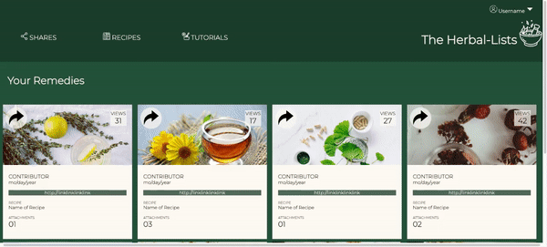

# Static Comp Challenge

### Preview of App:

### Context:
Mod 2 students were given a comp from which to mimic the layout and instructed to personalize the theme to create their own static comp for an app of their own design. This project was completed in 2 days during week 3 of Mod 2.

### Provided Comp for Layout:

### Abstract:
Herbal remedies used to be passed around communities and through generations, but in our modern age, not everyone is lucky enough to live in community with access to this kind of shared knowledge. Online classes to learn how to make herbal rememdies are great, but what about after you're done?

This app would allow users to share their recipes for their favorite home herbal remedies. Users could publish their own recipes to share or save recipes from other users to use for their own projects. Projects created from Herbal-Lists does for the herbalist community what Ravelry did for the knitting community by allowing non-commercial makers to share their projects and ideas. 

### Future Features: 
If I were to build out the functionality of this app, the future features I imagine would include: 
* User-made project cards, where users can document particular remedies. Each card would include: recipe source, recipe notes (to include variations from original recipes, suggestions for improvement, photos, ingredients list, warnings associated with any ingredients
* Remedy cards that contain recipes and instructions for particular remedies. These are created by individual users and can be shared between users. Users would be able to save these recipes for future use and a button on the card would allow a user to create a project card that links back to the original recipe. Recipe cards would track numbers of shares and views from other users.
* The ability to hide recipes behind a paywall or make them open source
* A dashboard to view saved recipe cards from other users for future reference
* A dashboard to view a user's personal projects
* An apothecary page where users can keep track of the herbs they have access to in their home apothecaries. Clicking an herb will bring users to a page that suggests recipes they have saved that include that herb in their ingredients list.

### Deployment Link:

https://smithkirsten.github.io/static-comp/

### Technologies Used
- HTML
- CSS 

### Contributors:
- [Kirsten Smith (they/them)](https://www.linkedin.com/in/kirsten-stamm-smith/)

### Wins + Challenges:

I was very excited about this project! Once I moved past the challenges of getting the layout set up, I really enjoyed designing the page and imagining the user story that could extend from it. I had fun adding hover states to the elements of the page. I would be so excited to build out the functionality of this app.

